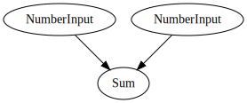

# Depends

[](https://crates.io/crates/depends)
[](https://docs.rs/depends/)
[](https://codecov.io/gh/Justice4Joffrey/depends-rs)
[](https://deps.rs/repo/github/Justice4Joffrey/depends-rs)

A library for ergonomic, performant, incremental computation between
arbitrary types.

## Why would I want that

Most applications rely on some core logic which must respond to external
events. Often, the logic to transform each event in to an action is
straightforward, but as the application scales, many hard to reason-with
situations emerge from the combinatorial explosion of states.

Dependency graphs are an excellent code architecture to tame complexity in
such scenarios.

``` rust
use std::{collections::HashSet, hash::Hash, rc::Rc};

use depends::{
    core::{Depends, Resolve, UpdateDependee, UpdateLeaf},
    derives::{Dependee, dependencies, Leaf},
};

// A `Leaf` is a node which takes new values from outside the graph. Nodes must
// implement `Hash`, attribute a hashable field as `#[depends(hash)]` or specify
// `#[depends(unhashable)]`.
#[derive(Leaf, Default, Hash)]
pub struct NumberInput {
    value: i32,
}

// `Leaf` types must provide a way for code outside to update their internal state.
// This is just a simple replace for now.
impl UpdateLeaf for NumberInput {
    type Input = i32;

    fn update_mut(&mut self, input: Self::Input) {
        self.value = input;
    }
}

// `dependencies` are derived to state what references `Dependee` nodes need to
// calculate their state on-demand. These could be any number of other `Dependee`s
// or `Leaf`s.
#[dependencies]
pub struct Components {
    left: LeafNode<NumberInput>,
    right: LeafNode<NumberInput>,
}

// A `Dependee` i.e. its state is a pure transformation of other nodes
#[derive(Dependee, Default, Hash)]
#[depends(dependencies = Components)]
pub struct Sum {
    value: i32,
}

// This trait specifies how a `Dependee` updates its internal state given its dependencies.
impl UpdateDependee for Sum {
    fn update_mut(&mut self, input: <Self as Depends>::Input<'_>) {
        // `ComponentsRef` is auto-generated by `Dependencies`. It's a read-reference
        // to each field of `Components`
        let ComponentsRef { left, right } = input;
        self.value = left.value + right.value;
    }
}

struct MyGraph {
    left: Rc<LeafNode<NumberInput>>,
    right: Rc<LeafNode<NumberInput>>,
    // `SumNode` is auto-generated by `Dependee`.
    sum: Rc<SumNode>,
}

// Compose a graph!
let left = NumberInput::default().into_leaf();
let right = NumberInput::default().into_leaf();
let sum = Sum::default().into_node(Components::new(Rc::clone(&left), Rc::clone(&right)));

let graph = MyGraph { left, right, sum };

// A `Visitor` is a collection which tracks which nodes have been visited each run.
let mut visitor = HashSet::<usize>::new();

// Resolving the graph from any node will traverse via Depth First Search, prompting
// recalculation for an node which has `State::Dirty`.
// 
// Using `resolve_root` ensures the visitor is cleaned each time, ready for use again.
assert_eq!(graph.sum.resolve_root(&mut visitor).value, 0);

// Update the leaves. Any dependent nodes will recompute their internal values.
graph.left.update(2);
graph.right.update(2);

// We've successfully implemented simple addition!
assert_eq!(graph.sum.resolve_root(&mut visitor).value, 4);
```

Clearly, to implement a simple addition problem, a dependency graph is
overkill. However, for more complex problems, where many inputs can change
and the output is a combination of many transformations on that input (and
derivations of it), `depends` can help you produce scalable, performant,
testable code out of the box.


## Graphviz

Any graph built using `depends` can be converted to a [Graphviz](https://graphviz.org/) representation
by passing a `GraphvizVisitor` (this requires the feature `graphviz`).

``` rust 
let graph = my_graph();
let mut visitor = GraphvizVisitor::new();
graph.answer.resolve_root(&mut visitor);
assert_eq!(
    graph.render().unwrap(),
    r#"
digraph G {
  2[label="Sum"];
  0[label="NumberInput"];
  1[label="NumberInput"];
  0 -> 2;
  1 -> 2;
}
"#);
```

The graph in the above example is rendered below.



## Current Status

This crate should be considered a Proof Of Concept only and treated with huge amounts of scepticism and distrust.

The guarantees we would _like_ to offer, before considering this crate production-worthy are:

- Determinism of output given any sequence of inputs and actions.
- Graphs cannot yield different results between calls to `resolve` without a change in input, other than when `Clean` has been implemented incorrectly.
- Correctness of the internal caching logic.

Feel free to experiment with the crate, apply it to your problems and pass on any feedback you have.

