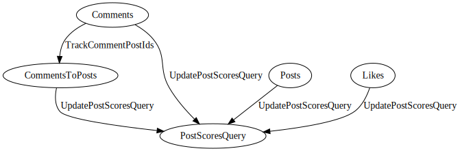
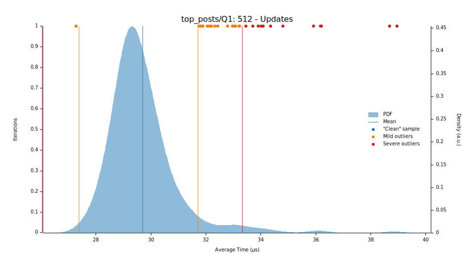

# Benchmarks for Depends

This repository contains the benchmarking results for the Depends Crate.

## Summary

The benchmarking tests were carried out by implementing the first query from
[A cross-technology benchmark for incremental graph queries](https://link.springer.com/article/10.1007/s10270-021-00927-5)
(Georg Hinkel et al.) comparing incremental computation approaches. The results showed that even a non-optimized
approach using `depends` was _faster_ across all problem sets than the recorded results for the same query.

However, it is important to note that these results should be taken with a pinch of salt. Although `depends` library
was faster, the results measured may appear to be slow, likely resulting from the fact these queries tend to be taken
from generic query resolving frameworks (each graph in `depends` is custom-built to solve a particular query). Despite
this, the main takeaway is that `depends` was able to generate the correct solution efficiently, without any significant
performance hindrances.

## Top Posts

This query aims to find the top posts in a social network. Comments can be the direct descendant of a post, or another
comment. Likes can be given to a comment.

The total score for each post is

```
score = 10 * number_of_comments + number_of_likes
```

Where `number_of_comments` is the number of comments that are descendants of the post, and `number_of_likes` is the
number of likes given to any descendent comment.

The graph of the solution can be seen below:



It's worth noting that the intermediate `CommentToPosts` node will considerably reduce performance, as it results in
each comment which has changed being iterated over twice. It was included as a way to demonstrate encapsulation of
logic to promote node-reusability in `depends`.

### Results

`depends` was faster for all problem sets than the recorded results for the same query for both Initialization and
Updates.



Over the largest problem considered (512 - Updates), `depends` was able to resolve the query in under _35 microseconds_
on
an AMD Ryzen 7 5800X 8-Core Processor. This is significantly faster than any recording in the study. The fastest on the
study 'YAMTL Incremental' was recorded at
around [700 microseconds](https://link.springer.com/article/10.1007/s10270-021-00927-5/figures/12)
for the same test (caution: this is suspiciously slow).

## Running the Benchmarks

### Download the Data Set

Before you begin, make sure to clone the input dataset repository.

```sh
git clone https://github.com/Justice4Joffrey/depends-benchmark-data.git /tmp/depends-benchmark-data
```

### Run the Benchmarks

To run the benchmarks, simply run the following command:

```sh
# wherever you cloned the repository
BENCH_DATA_DIR=/tmp/depends-benchmark-data \
  cargo +nightly bench
```

We require nightly to use the `BinaryHeap::retain` method, which was stabilised in 1.70.0.
