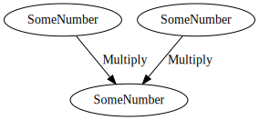

# Graphs

After defining our dependencies, operations and values, we're finally ready to construct a graph and resolve its output!

```rust
{{#include ../../examples/src/docs/simple_graph.rs:simple_graph}}
```

Whilst the graph we've built so far is modest, and in no way justifies use of a dependency graph, we've demonstrated
the basic building blocks of Depends. For applications which are likely to grow in complexity, this framework will
allow us to maintain confidence in the correctness of our code.

## Visualising with Graphviz

By enabling the `graphviz` feature, we can get a Graphviz representation of the graph:

```rust
{{#include ../../examples/src/docs/simple_graph.rs:graphviz}}
```

This `dot` file format can be used with any Graphviz rendering tool to produce the following graph:

<p align="center">
  
</p>

> It's also possible to _build_ graphs in Depends from the dot format. We'll show that off in a [later chapter](reducing_more_boilerplate.md) of this book.
