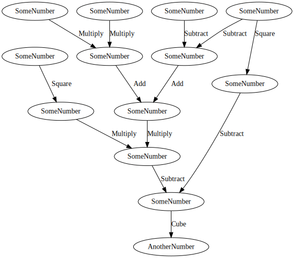
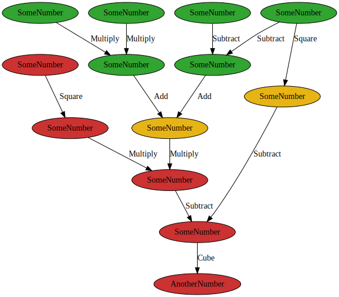
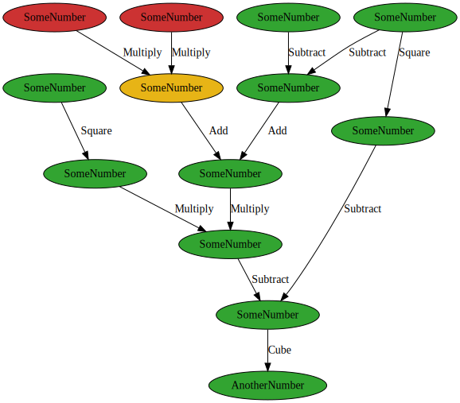

# Raising the Stakes

Now that we've got a basic understanding of how to structure logic with Depends, let's start ramping up the complexity.

We can use the special `DiagnosticsVisitor` and `resolve` to identify when nodes have their internal value calculated.

```rust
{{#include ../../examples/src/docs/raising_the_stakes.rs:complex_graph}}
```

We've now created this pretty gnarly graph:

<p align="center">
  
</p>

## Incremental Computation

Let's demonstrate incremental computation in action. Suppose now we wanted to update the value of node `e`.

```rust
{{#include ../../examples/src/docs/raising_the_stakes.rs:incremental_computation_1}}
```

So, only 4 derived nodes were recomputed that time, saving us from all those costly math operations! A graphical
representation of how this looks is below. The red nodes dirty or recomputed. The amber nodes provided cached values to
their dependents. The green nodes were unchanged.

<p align="center">
  
</p>

What would happen if we were to swap the values of `a` and `b`?

```rust
{{#include ../../examples/src/docs/raising_the_stakes.rs:incremental_computation_2}}
```

We can see that only a single node had to be recalculated this time. Despite the node multiplying `a` and `b` being
recalculated, its hash value remained the same. This resulted in its dependent nodes _not_ considering their
dependencies dirty, therefore returning cached values.

Organizing nodes to effectively cache values of nodes further up the dependency path can lead to significant performance
gains, particularly in large dependency graphs with costly calculations.

A graphical representation of this is below.

<p align="center">
  
</p>

> Note that each Visitor will have its own `Hasher`, so using a different visitor will cause all nodes to be dirty.
> For best results, use a single visitor for the lifetime of a graph.
