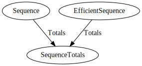

# Examples

Examples with Graphviz visualisations generated by `depends`.

## Custom Clean

How to provide a custom `Clean` implementation for efficient evaluation.

## Early Exit

How to exit early from a graph resolution.

## Maths

A combination of basic computing units to achieve an answer on demand.

