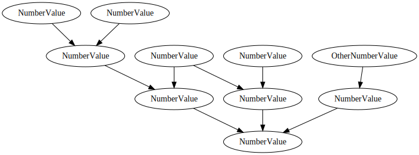

# Maths

An example graph showing a combination of basic computing units to achieve an answer on demand, using the `depends` library.

## Graphviz

Here's a visualisation of this graph, generated by `depends`.

